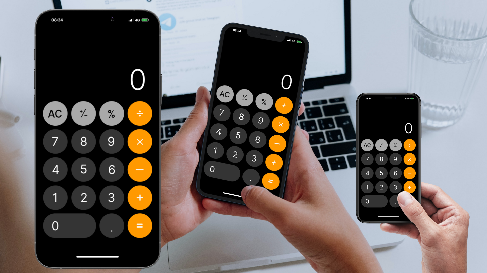

# Calculator - React

Uma calculadora simples desenvolvida em React para praticar conceitos fundamentais do framework e criar uma interface de usuário interativa.

## 🚀 Funcionalidades

- Adição, subtração, multiplicação e divisão
- Limpar operação e apagar último dígito
- Interface simples e intuitiva

## 🛠 Tecnologias Utilizadas

- **React**: Biblioteca JavaScript para construção de interfaces de usuário
- **JavaScript**: Lógica da calculadora
- **CSS**: Estilização da interface
- **HTML**: Estrutura do layout